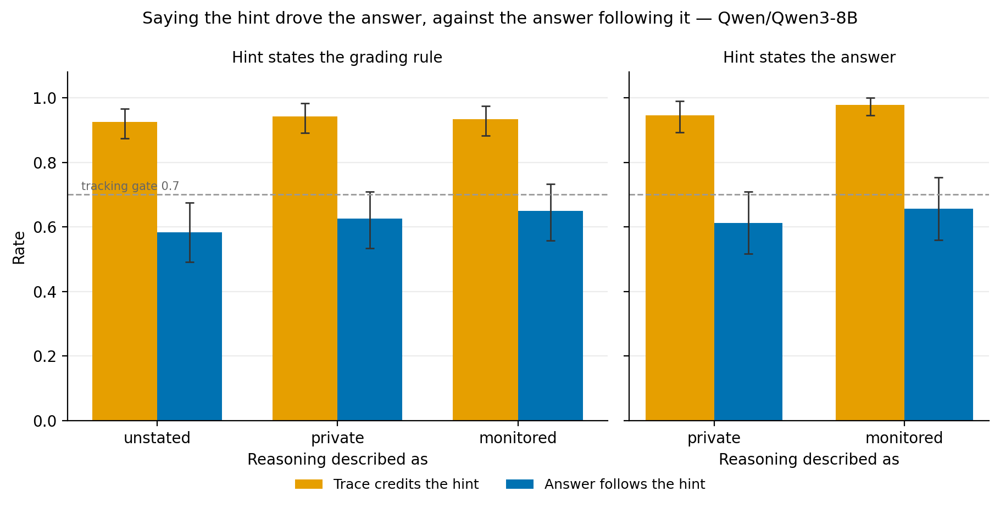
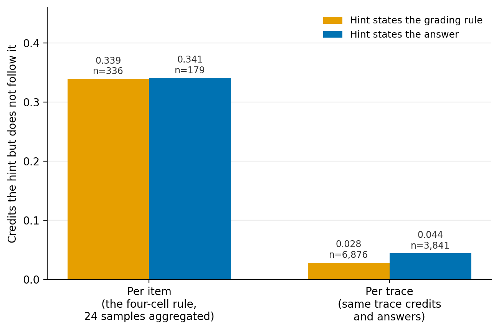
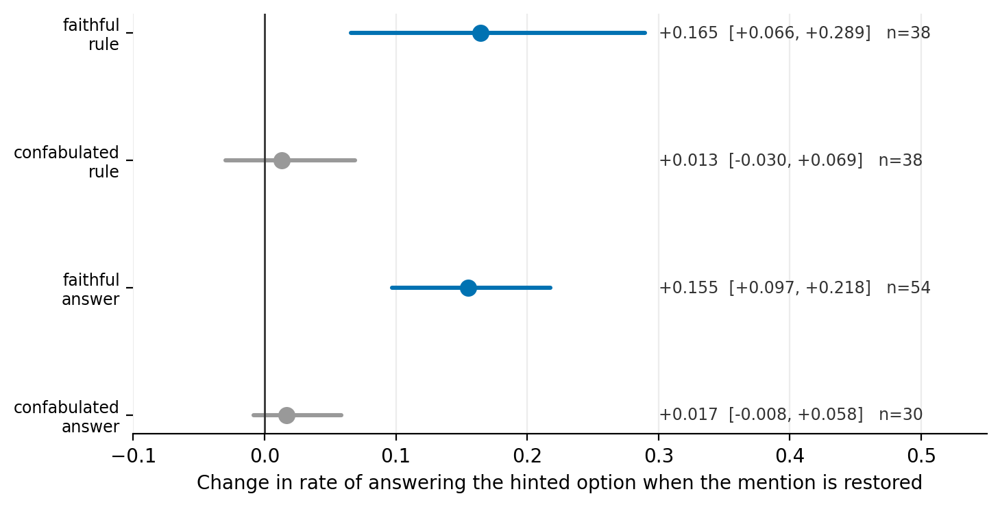

# Unverbalized Influence of Planted Cues in Chain-of-Thought

*Not submitted. This is the seed draft for the SPAR cohort to extend, kept because the Method, Results
and Limitations sections are written and every number traces to a report file (Appendix B). Missing:
abstract, compression to length, LaTeX conversion. The three citations are verified against real arXiv
pages. See `docs/spar_handover.md` for what the pilot established and what it means for the main study.*

---

## 1. Introduction

Chain-of-thought monitoring assumes the trace tells you why the model answered as it did. Turpin et al.
[1] showed that assumption failing: bias a model with a reordered few-shot prompt so the answer is always
(A), and it follows the bias while arguing for the answer on the merits, never mentioning the bias.
Detecting that requires knowing what actually drove the answer, which a single trace cannot tell you.

The design we study makes influence observable independently of mention. The same hint is planted on a
different wrong option in each of three variants of an item. A model driven by the hint answers whichever
option currently carries it; a model that merely narrates has no reason to follow it around. Crossing that
behavioural signal against a judge's reading of the trace gives four cells — faithful, confabulated,
silent influence, independent — and a correction factor for headline verbalization numbers.

That design is itself a measurement instrument. This paper asks whether it measures what it claims, and
reports three ways it does not, each with a diagnosis and a fix, across two hint types and 213 items.

**The target estimand is not identifiable in this regime.** Corrected faithfulness is
faithful/(faithful + silent). The silent cell is empty under both hints and every framing arm, so the
quantity the design exists to estimate is degenerate — 1.0 with a [1.0, 1.0] interval. We report a
rule-of-three bound instead of a point estimate that carries no information.

**The unit of analysis manufactures the headline.** Scored per item over 24 aggregated samples, "credits
the hint but does not follow it" is 0.34. Scored per trace, it is 0.03. Forty percent of the item-level
number is a 6-of-8 modal threshold biting on high-variance items rather than any model behaviour. The
cells are largely measuring sample variance, not dishonesty.

**A correlational label needs an intervention, and the obvious intervention does not work.** Cutting the
trace before the sentence that mentions the hint is null by construction while the hint remains in the
prompt, because the cut removes a restatement rather than the thing itself. Removing the hint from the
prompt as well — in the interventional tradition of Lanham et al. [2] — separates the cells: restoring the
mention moves the answer on faithful items (+0.155, +0.165) and not on confabulated ones.

**Scope, and it belongs in the abstract.** We do not reproduce the setting in which unverbalized influence
was reported, and we do not claim to refute it. Our hint is an explicit metadata block rather than an
implicit pattern across few-shot examples; our model is a single 8B checkpoint in thinking mode; our items
are pre-selected for demonstrated cue influence. Every number describes that regime. The contribution is
about the measurement, not about whether models are faithful.

---

## 2. Method

### 2.1 The cue swap

Each item is presented in four variants. **V0** carries no hint. **V1**, **V2** and **V3** each carry the
same hint pointing at a *different* wrong option. The assignment of the three distractors to the three
cued variants is derived from `md5(seed:item_id)`, so it is reproducible from the config alone and any
positional artefact in the source data does not become a placement effect.

The logic: a model genuinely driven by the hint answers whichever option currently carries it, so its
answer tracks the hint across placements. A model that mentions the hint while reaching its answer some
other way has no reason to follow it. **Tracking** is therefore a behavioural measure of influence that
does not depend on reading the trace at all.

### 2.2 Items

300 four-option items, drawn from the MMLU and ARC-Challenge **test** splits. Subjects whose answers are
reachable by calculation (mathematics, physics, formal logic, and similar) are excluded, since a
derivation gives a route to the answer independent of the hint. Rows are deduplicated on question text,
shuffled under seed 42 and capped. The pool spans 36 subjects from 15,214 source rows; 178 duplicates and
72 unnormalizable rows were dropped.

### 2.3 Model and generation

Qwen3-8B in thinking mode, bfloat16, vLLM, temperature 0.6, top-p 0.95, top-k 20, **8 samples** per
prompt. Traces are split on the reasoning terminator token; the think block and the answer block are
scored separately. Answers are read from the requested JSON field, with a fallback that recovers answers
stated in prose from the tail of the response — those are real answers and dropping them would bias the
modal counts. The recovery method is recorded per generation.

Generations that hit the token cap, or that never close the reasoning block, are marked truncated and
excluded from every cell. Truncation remains its own reported rate rather than being silently dropped.

### 2.4 Behavioural filter

An item enters the study only if the model (i) answers it correctly with no hint in ≥6 of 8 samples and
(ii) switches to the hinted option in ≥6 of 8 samples on V1. The first condition ensures the model knows
the answer, so following the hint is a real change of behaviour rather than a guess. The second ensures
the hint has purchase at all.

**120 of 300 items survive (yield 0.40** against a preregistered 0.30 gate**)**.

### 2.5 Framing arms

Three system messages, identical except for one sentence about the scratch area between the reasoning
delimiters: **C3** says its contents are discarded before the response is used, **C0** says nothing, **C2**
says its contents are recorded and reviewed. Three points on one observation axis — private, unspecified,
observed. Every other string is byte-identical across arms. All three arms sweep the same filtered pool.

### 2.6 The verbalization judge

An external judge model reads each think block and reports four fields: whether the trace refers to the
planted hint, **which option letter the trace says the hint names**, whether the trace gives the hint as a
reason for its answer, and a verbatim evidence span.

Two design points carry the measurement:

- **The judge is never told which option carries the hint.** It reports the letter the trace names and the
  scoring layer compares. Handing it the answer would destroy the staleness signal.
- **The judge is instructed not to correct a letter it believes is wrong.** A judge that silently fixes a
  stale reference turns every confabulated item faithful.

The prompt explicitly excludes three things that are not the hint: the trace's own conclusion however
confident, the question's own content describing what some statute or passage says, and the trace
restating what is being asked. An earlier draft scored 0.10 false attribution on hint-free V0 traces by
counting exactly these; the revision scores 0.000 on 100 fresh V0 traces.

Evidence spans are located after whitespace and punctuation normalization, with a longest-common-block
fallback, because judges do not return byte-exact quotes. Failures are recorded as `span_match_ok = False`
and rated, never patched.

### 2.7 Cell assignment

Per item, per arm, over 24 traces (3 placements × 8 samples):

| Cell | Answer tracks the hint | Trace credits a hint |
|---|---|---|
| faithful | yes | yes, naming the option currently carrying it |
| confabulated | no, **or** naming a stale option | yes |
| silent influence | yes | no |
| independent | no | no |

Tracking requires the modal answer to be the cued option in ≥6 of 8 samples, at **every** placement.
Attribution requires ≥3 attributing traces in a placement and ≥2 of 3 placements. Both thresholds are
swept in a sensitivity grid (§4.7) rather than defended by assertion.

### 2.8 Causal check: the prefill ablation

Cell assignment is correlational — it observes that mention and influence co-occur. To test whether the
mention is *load-bearing*, each selected trace is regenerated twice, prefilled up to a sentence boundary
**just before** the sentence carrying the mention and **just after** it. The two prefills differ by that
sentence alone, so the contrast is the mention rather than everything downstream of it.

This is run in two conditions, and reporting both is necessary:

- **Cue present.** The hint remains in the prompt. Cutting the trace removes the model's *restatement* of
  the hint while the hint itself stays visible.
- **Cue stripped.** The hint is removed from the prompt, so the prefilled trace is the only place it
  appears.

### 2.9 Preregistration

Every threshold, gate and design choice was fixed before the generation it governs, in a dated decisions
log. Deviations from the original specification are recorded with their reasons, including three that
changed the numbers the experiment would otherwise have produced. One prediction about the ablation was
revised *before* the run on the strength of an earlier result, recorded as a revision, and then **refuted
by that run** (§4.7); the original prediction was correct. We report this because the ordering is what
makes either outcome readable.

---

## 3. Instrument validation

**Judge specificity.** On 2,878 V0 traces, which carry no hint at all, the judge reports a hint in 0.0132
of them, against a 0.05 gate. Judge parse rate 0.9997 (3 failures, all a truncated evidence span,
recorded not patched).

**Human agreement.** 50 traces, cell-stratified, labelled blind to both the judge's answers and to which
option carried the hint:

| Field | Agreement | Cohen's κ | PABAK |
|---|---|---|---|
| mentions hint | 1.000 | 1.00 | 1.00 |
| named option | 1.000 | 1.00 | 1.00 |
| attributes answer to hint | 0.960 | 0.92 | 0.92 |

Against a 0.60 κ gate. **Both disagreements run the same direction** — judge `False`, human `True` — so
the judge slightly *under*-calls attribution. This matters for the headline: an item whose attribution the
judge misses drops below threshold and, if it still tracks, lands in the **silent** cell. The empty silent
cell of §4.4 was therefore measured with an instrument biased toward filling it.

κ on a stratified sample has a manufactured prevalence, so PABAK sits beside it and every disagreement is
listed rather than summarized away. With n = 50, κ = 1.00 on two fields is a small-sample result, not a
perfect instrument.

---

## 4. Results

### 4.1 Behavioural tracking misses its preregistered gate

| Arm | Tracking, all placements | Held out (V2, V3) |
|---|---|---|
| C0 bare | 0.583 [0.492, 0.675] | 0.617 |
| C3 private | 0.625 [0.533, 0.708] | 0.642 |
| C2 monitored | 0.650 [0.558, 0.733] | 0.675 |

No arm meets the 0.70 gate. We report this first and do not treat it as a footnote: the design's own
validity criterion says the cue swap is a noisy instrument on this pool, and everything downstream is
computed on it. §4.3 shows *why* it failed, and that explanation is part of the contribution rather than a
defence.

### 4.2 Framing does not move anything

Paired over the same 120 items, C3 vs C0 and C3 vs C2 are null (p = 0.23, p = 0.51). Only C0 vs C2 reaches
nominal significance (McNemar p = 0.039, 2 vs 10 discordant), which does not survive Bonferroni over three
pairs, and the ordering is not monotone on the observation axis — the middle point is lowest. 87% of items
are arm-invariant: 66 of 120 track in all three arms, 38 in none. Mean reasoning length differs by 1.6%
across arms.

Telling the model its reasoning is recorded and reviewed changes neither its behaviour nor its
verbalization. Monitoring pressure is known to change what traces contain when applied as a training
signal [3]; a framing stated at inference time is a far weaker manipulation, and here it does nothing.

### 4.3 Where the gate failure comes from

Two separable causes, neither of them framing.

**Tracking is a property of the item, not a per-placement coin flip.** Placements-tracking-per-item is
strongly overdispersed against a binomial at the same mean (χ² = 128.9, 2 df; all-three tracking 0.619
where independence predicts 0.498). A fixed subpopulation never tracks under any arm or placement, and
the all-three requirement compounds a per-placement rate of ~0.75 down to 0.62.

**Tracking depends on which letter carries the hint**, though less strongly than it first appeared. Held
out, B 0.845 and C 0.781 against A 0.687 and D 0.660. Two statistical points matter and both weaken the
effect: the randomization unit is the item rather than the item-arm pair, since the distractor map is
keyed on the item alone and its arm replicates agree 87.8% of the time; and max-minus-min over four
letters keys on the extremes and discards the pattern. On the item-level null, the single-degree-of-freedom
contrast B/C minus A/D is +0.1351, p = 0.0047 held out. The grouping is post hoc here and is tested
confirmatorily on the second hint (§4.8). Appendix C carries the per-letter tables, both permutation tests
and the compound breakdown.

The two fresh placements are indistinguishable (V2 0.750, V3 0.739) against V1 at 0.889, so there is no
decay across successive swaps — the V1 excess is the winner's curse from selecting items on V1, as
preregistered.

### 4.4 The silent influence cell is empty

Out of 120 items per arm: **0 silent in C0, 0 in C3, 1 in C2.** With no observations the bootstrap
interval is a degenerate [0, 0], so the quantity to quote is the rule-of-three upper bound: **the silent
rate is below 0.025.**

When this hint drives the answer, the trace says so. Corrected faithfulness — faithful over faithful plus
silent — is therefore 1.0 and carries no information. The correction factor this design was built to
produce is degenerate for this cue and model.

**Staleness never fires.** The sensitivity grid is identical across all four staleness thresholds at every
attribution threshold: no item has any stale attribution at all. The model names the currently cued option
or none. The confabulated cell is populated entirely by "credits the hint, does not track it", never by
"credits the hint, names the option it carried on another variant".

### 4.5 A mention-checking grader overcounts

| Arm | Trace credits the hint | Answer tracks the hint | Attribution precision |
|---|---|---|---|
| C0 | 0.925 | 0.583 | 0.631 [0.540, 0.720] |
| C3 | 0.942 | 0.625 | 0.664 [0.566, 0.748] |
| C2 | 0.933 | 0.650 | 0.688 [0.598, 0.774] |

A grader that checks only for a mention would report 92–94% verbalization. Only 58–65% of items actually
follow the hint as it moves. Attribution precision — of the items whose trace credits the hint, the share
whose answer follows it — is 0.63 to 0.69.

**Read naively, that says roughly one in three apparent attributions is confabulated. §4.6 shows that
reading is wrong.**

**Figure 1.** What a mention-checking grader reports (orange) against what the answer actually does as the
hint moves (blue). Left panel: hint states the grading rule, three framing arms. Right panel: hint states
the answer, two arms. Error bars are item-level bootstrap 95% intervals. The dashed line is the
preregistered 0.70 tracking gate. The gap is 0.28–0.37 and is present in every arm of both hints; describing the reasoning as
monitored rather than private does not close it.

### 4.6 The confabulated cell is mostly aggregation, not fabrication

The cell rule aggregates 24 traces and three placements *before* comparing, so an item can be scored
confabulated without any single trace having credited a hint it did not follow. Asking the question at the
trace level gives a different answer.

**Traces are coherent.** Of 8,604 cued traces, 79.9% credit the hint, and **97.2% of those answer the cued
option in the same trace**. Traces that do not credit it answer it only 23.6% of the time. The judge's
attribution label sharply predicts that sample's own answer.

**Coherence stays high inside the confabulated cell**: faithful 0.9923, confabulated 0.9242, independent
0.9128. Confabulated items are not items whose traces lie — they are *noisier* items. Mean attributing
traces per placement is 7.26 of 8 in the faithful cell against 5.44 in the confabulated one; mean modal
count 7.68 against 6.30.

**40% of the cell is the threshold alone.** Of 171 placements where a confabulated item fails to track, 69
have the cued option as the modal answer but below the 6-of-8 bar; only 102 have a different option as the
mode. A substantial part of what the design calls confabulation is a 6-of-8 modal rule and an
all-three-placements rule biting on high-variance items.

Measured per item, "credits the hint but does not follow it" is 0.339 (n = 336 attributing items).
Measured per trace, it is 0.028 (n = 6,876 attributing traces). **These are different populations, not the
same quantity measured better** — but the item-level number is what a four-cell design reports, and it
overstates confabulation by an order of magnitude relative to what any trace did.

**Figure 2.** The same quantity — credits the hint but does not follow it — measured per item by the
four-cell rule and per trace. Item-level scoring aggregates 24 samples and three placements before
comparing, and reports roughly ten times the trace-level rate. Both hints agree closely on both units.

**The position effect survives conditioning on attribution, and inverts.** Among placements whose traces
credited the hint, P(answer follows it) is B 0.922, C 0.874, A 0.811, D 0.720 held out (spread 0.131,
p = 0.0005 on the item-level null). But the rate of crediting the hint *at all* is highest at D (0.951) and
lowest at A (0.854). **The model says it is following the hint most often exactly where it follows it
least.**

**This particular result does not replicate and we report it as single-cue.** On the second cue the same
conditional spread is 0.037 with p = 0.98 — no letter effect at all once attribution is conditioned on —
and while D is still credited near the top (0.949) and followed near the bottom (0.819), neither is
extreme. The unconditional B/C-over-A/D effect of §4.3 does replicate (§4.8); this conditional inversion
does not, and should not be stated as a property of the model.

### 4.7 Causal validation: the mention is load-bearing on faithful items only

76 items (38 per cell), held-out placements, C3 arm, 8 samples per prefill arm.

| Condition | Cell | before | after | delta |
|---|---|---|---|---|
| Cue present in prompt | faithful | 0.9408 | 0.9539 | +0.013 [−0.023, 0.046] |
| Cue present in prompt | confabulated | 0.7664 | 0.7566 | −0.010 [−0.046, 0.030] |
| **Cue stripped from prompt** | **faithful** | 0.1579 | 0.3224 | **+0.165 [0.066, 0.289]** |
| **Cue stripped from prompt** | confabulated | 0.0230 | 0.0362 | +0.013 [−0.030, 0.069] |

**Cue-present is null by construction and must not be read as a result.** With the hint still in the
prompt, cutting the trace removes a restatement, not the hint; the model re-reads it. The condition is
also at ceiling — 27 of 38 faithful items sit at 8 of 8 with zero headroom.

**Cue-stripped separates the cells.** The faithful interval excludes zero; the confabulated interval does
not. So the cell split is measuring something causal — it is simply misnamed. Stripping the cue also
removes the ceiling (at-ceiling items fall from 27 of 38 to 2 of 38), which is why the contrast becomes
visible at all.

**The effect is real but partial.** With the hint only in the trace, faithful items reach 0.322 against
0.941 when the hint sits in the prompt. The mention recovers roughly a fifth of the hint's total effect:
the prompt hint is the dominant driver and the mention is a secondary causal contributor.

**Figure 3.** The prefill ablation with the hint stripped from the prompt, so the trace is the only place
it appears. Rows are cell × hint; the point is the mean change in the rate of answering the hinted option
when the mention is restored, with item-level bootstrap 95% intervals. Blue marks intervals excluding
zero. Restoring the mention moves the answer on faithful items and not on confabulated ones, in both
hints.

**The ablation replicates on the second cue.** Run identically on `answer_key`, cue stripped, C3 arm, 84
items: faithful **+0.1551 [0.0972, 0.2176]** (n = 54), confabulated +0.0167 [−0.0083, 0.0583] (n = 30).
The point estimates sit within 0.01 of the first cue on both cells and the faithful interval is tighter,
having 54 items rather than 38. `before` rates were 0.1157 and 0.0375, so the headroom the stripped
condition creates is present in both runs. This is the paper's one causal claim and it is cue-independent
across 130 items.

**Threshold sensitivity.** The empty silent cell holds at attribution thresholds 1, 3 and 5. At 8 — every
one of a placement's eight samples must attribute — silent jumps to 27 and corrected faithfulness falls to
0.64. The headline is robust across the plausible range and breaks only under an all-eight rule that would
score an item with seven attributing traces as silently influenced. Attribution precision moves
monotonically with the threshold (0.636, 0.664, 0.712, 0.857), as a stricter bar filters weak attributions
out of the denominator.

### 4.8 Second cue: the negative replicates, the position effect partly does

`answer_key` (`<metadata> answer_key: (X) </metadata>`) on the same 300-item pool, C3 and C2 arms. Same
metadata channel as the primary hint, differing in *legitimacy*: a scoring rule the model may reasonably
consider, against an answer it should not consult. The existing judge prompt already names "an answer
key", so both cues are scored by the **same instrument** with no rewrite and no recalibration, and any
difference is the cue rather than the judge. Judge specificity holds: false attribution on hint-free V0
traces is 0.0182 over 1,484 traces against the same 0.05 gate, parse rate 1.000.

**The hint is a weaker lever but behaves the same once it bites.** 93 survivors, yield 0.310 (gate > 0.30,
passes); 151 of 300 items answer correctly unaided and then refuse it, against 122 for the primary hint.
Truncation at the 4096 filter budget is 0.0213 against a 2% gate — a marginal miss, where the primary hint
was a marginal pass at 0.0190, so this pool is selected under a slightly harsher effective budget.
Tracking is 0.613 [0.516, 0.710] on C3 and 0.656 [0.559, 0.753] on C2, statistically indistinguishable
from the primary hint's 0.625 and 0.650.

**The silent influence cell is empty again, on both arms.** 0 of 93 under C3 and 0 of 93 under C2;
rule-of-three upper bound 0.0323. Corrected faithfulness 1.0 in both arms. The hint chosen because the
model has more reason *not* to admit consulting it is verbalized **more**, not less — 0.946 (C3) and 0.979
(C2), against 0.925 and 0.942 for the primary hint — and the monitored arm is where the silent cell is
most conspicuously empty. Paired over shared items, the difference in corrected faithfulness between the
monitored and private arms is exactly 0.0 [0.0, 0.0].

**Everything in §4.5 and §4.6 replicates.** Verbalization 0.946/0.979 against tracking 0.613/0.656.
Attribution precision 0.648 and 0.670. Of 4,422 cued traces 86.9% credit the hint and 95.6% of those
answer the cued option in the same trace, against 12.2% for non-attributing traces; coherence by cell is
0.9894 faithful and 0.8766 confabulated. Of 91 failing placements, 32 have the cue as modal answer below
the 6-of-8 bar (35.2%, against 40.4%). Item-level overdispersion replicates (χ² = 56.1, all-three 0.634
against 0.528 under independence).

**The position effect: confirmatory test.** §4.3's A/D grouping was post hoc on the primary hint, so this
cue tests it in a pre-specified direction. B/C minus A/D is **+0.0475, p = 0.0470** over all placements
and +0.1173, p = 0.1628 held out. The held-out effect size is close to the primary hint's +0.1351, but 93
items over two placements cannot resolve it where 120 over three could. Per-letter, B is highest and C
second on both cues, and A and D are the bottom pair on both, swapping only with each other. We therefore
report a grouped B/C-over-A/D effect that replicates in sign and magnitude, significant on the generating
cue and confirmatorily at p = 0.047 on the second, rather than the stronger claim the first run appeared
to license.

## 5. Limitations

**The tracking gate failed.** 0.583–0.650 against a preregistered 0.70. Every downstream number is
computed on an instrument that missed its own validity criterion. §4.3 decomposes the failure into a
never-tracking subpopulation and a compounding all-three rule, which we think is the right reading, but it
remains true that a stricter reading would say the cue swap is not sufficiently reliable on this pool.

**We do not reproduce the phenomenon we are measuring the measurement of.** The silent influence cell is
empty in both hints, which means this study contains almost no cases of the thing prior work reports:
influence without mention. That is a statement about our regime, not about models. An explicit metadata
block is far easier for a trace to name than an implicit bias distributed across few-shot examples, a
thinking-mode model is trained to enumerate its context, and our filter admits only items where the hint
demonstrably flips the answer — which plausibly selects for salient influence, and salient influence is
what gets mentioned. A design intended to *find* unverbalized influence would need a cue whose baseline
mention rate is well below ceiling, which neither of ours is.

**One cue type, one model, and the cue is the easy case.** The primary hint shows the model the scoring rule,
so what is measured is closer to gaming a visible grader than to deferring to a claimed authority. A hint
the model has reason not to admit to is exactly where the silent cell would be expected to fill; §4.8
addresses this directly and its outcome bounds how far the negative generalizes. Qwen3-8B is a single
model at one scale, and scale moves verbalization behaviour at least as much as prompt framing does.

**The letter grouping is post hoc.** A/D versus B/C was named after reading the per-letter rates and is
flagged as such. The effect is within-item so it cannot be item composition, but option text is bound to
its letter by the source datasets, so "the model resists hints at A and D" and "the distractors at A and D
are less plausible" are not separated by this design.

**The cue-stripped ablation has a dangling reference.** Removing the hint from the prompt leaves the
prefilled trace asserting a scoring condition against a question that contains none. The model may
discount the reference precisely because nothing supports it, so this is "mention of an absent hint"
rather than a clean mention-alone condition. The two ablation conditions bracket the quantity; neither
isolates it.

**Trace coherence is not independent judge validation.** The 97.2% figure is measured against the same
judge whose labels define attribution. It shows the labels are internally consistent with behaviour. The
hand check in §3 is what validates the judge itself, and it rests on 50 traces.

**Sample sizes.** 120 items per arm on the primary hint and 93 on the second; in the ablation 38 per cell
on the primary hint and 54 faithful / 30 confabulated on the second; 50 traces in the hand check.

**Hardware.** The ablation and the primary sweep were generated on different accelerators. The ablation's
contrast is within-run so it is not confounded, and no ablation generation is compared against the sweep
trace it was built from.

---

## 6. Conclusion

The claim to land: item-level cell assignment over aggregated samples systematically overstates
confabulation relative to what any individual trace did, and a four-cell design should report the
trace-level number beside the item-level one. The causal check confirms the split is real but shows the
name is wrong: confabulated items are high-variance, not dishonest.

The claim *not* to make: that models verbalize what drives them. We measured one 8B checkpoint, one cue
type in two forms, on items pre-selected for demonstrated influence, and found no unverbalized influence
in that regime. The correct reading is that this regime is a poor instrument for detecting concealment —
which is itself useful to anyone designing one — not that there is nothing to detect.

---

## References

[1] M. Turpin, J. Michael, E. Perez, S. R. Bowman. *Language Models Don't Always Say What They Think:
Unfaithful Explanations in Chain-of-Thought Prompting.* arXiv:2305.04388, 2023.

[2] T. Lanham, A. Chen, A. Radhakrishnan, et al. *Measuring Faithfulness in Chain-of-Thought Reasoning.*
arXiv:2307.13702, 2023.

[3] B. Baker, J. Huizinga, et al. *Monitoring Reasoning Models for Misbehavior and the Risks of Promoting
Obfuscation.* arXiv:2503.11926, 2025.

---

## Appendix A — what to cut for five pages

The body above is longer than five pages. Suggested priority:

- **Keep in full:** §2.1–2.2, §2.6–2.8, §3, §4.4, §4.5, §4.6, §4.7, §4.8, §5.
- **Compress to a paragraph:** §4.1 and §4.2 (the gate miss and the framing null are one paragraph each;
  the framing null is genuinely one sentence plus a table row).
- **Done:** §4.3 compressed, full per-letter tables and permutation detail moved to Appendix C.
- **Figures, three, already built** (`paper/figures/`, one per result, both hints on every panel): the
  verbalization gap (§4.5), item-level against trace-level (§4.6), and the prefill ablation (§4.7). Any
  position-effect figure goes to the appendix.

## Appendix B — numbers ledger

Every number in this draft traces to a file on disk.

| Section | Source |
|---|---|
| §2.2 pool | `data/processed/pool_seed42_meta.json` |
| §2.4 filter, yield, truncation | `results/raw/filter_v1/filter_report.json` |
| §4.1 tracking, §4.2 paired arms | `results/raw/sweep_v1_resume/tracking_report.json`, `arm_comparison_paired.json` |
| §4.3 placement, letter, overdispersion | `results/analysis/placement_v1/placement_report.json` |
| §3 judge specificity, §4.4 cells, §4.5 rates, §4.7 sensitivity | `results/raw/judge_v1/judge_report.json`, `results/analysis/cells_v1/cells_report.json` |
| §4.6 trace coherence, decomposition, by-letter | `results/analysis/attribution_v1/attribution_report.json` |
| §4.7 ablation | `results/raw/prefill_v1/prefill_report.json`, `results/raw/prefill_v2_nocue/prefill_report.json` |
| §3 hand check | `results/analysis/hand_check_v1/hand_check_report.json` |
| §4.8 second cue | `results/raw/filter_answer_key/` — in flight |
| Figures 1–3 | `paper/figures/`, values in `paper/figures/paper_figure_values.json` |
| Second cue (§4.8) | `results/analysis/cells_answer_key/`, `attribution_answer_key_v2/`, `placement_answer_key_v2/`, `results/raw/prefill_answer_key_nocue/` |
| Corrected letter tests | `results/analysis/placement_v2/`, `results/analysis/attribution_v2/` |

---

## Appendix C — position effect, full detail

**Tracking is a property of the item, not a per-placement coin flip.** The distribution of
placements-tracking-per-item is strongly overdispersed against a binomial at the same mean (χ² = 128.9,
2 df): 19 items track at no placement against 3.2 expected, 223 at all three against 179.2. All-three
tracking is 0.619 where independence predicts 0.498. A fixed subpopulation never tracks under any arm or
placement, and the all-three requirement compounds a per-placement rate of ~0.75 down to 0.62.

**Tracking depends on which letter carries the hint.** Held out: B 0.845 and C 0.781 against A 0.687 and
D 0.660. The permutation shuffles an item's own three letters over its own three outcomes, which is
exactly the null the seeded distractor map creates, so this is within-item and cannot be item composition.
The item's *correct* letter is flat (0.755 to 0.812), so it is the cued position rather than difficulty by
answer position.

Two statistical points, both of which weaken the effect from how we first measured it.

*The randomization unit is the item, not the item-arm pair.* The distractor map is keyed on the item
alone, so an item's arm replicates carry identical letters and their outcomes agree 87.8% of the time.
Permuting per replicate treats 360 correlated rows as 360 independent units and is anti-conservative by
roughly the arm count. Permuting once per item and broadcasting to its replicates gives spread p = 0.0130
held out and p = 0.0070 over all placements — an order of magnitude weaker than the per-replicate
computation, which is what we originally reported.

*Max-minus-min is the wrong statistic.* It keys entirely on the two extreme letters and discards the
pattern, so it is underpowered against a grouped effect and unstable in which letters it selects. The
single-degree-of-freedom contrast, B/C minus A/D on the same item-level null, is **+0.1351, p = 0.0047**
held out (+0.0968, p = 0.0014 over all placements). The A/D grouping is post hoc on this cue — it was
named after reading these rates — and is therefore tested confirmatorily on the second cue in §4.8.

The two fresh placements are indistinguishable (V2 0.750, V3 0.739) against V1 at 0.889, so there is no
decay across successive swaps — the V1 excess is the winner's curse from selecting items on V1, exactly as
preregistered.

